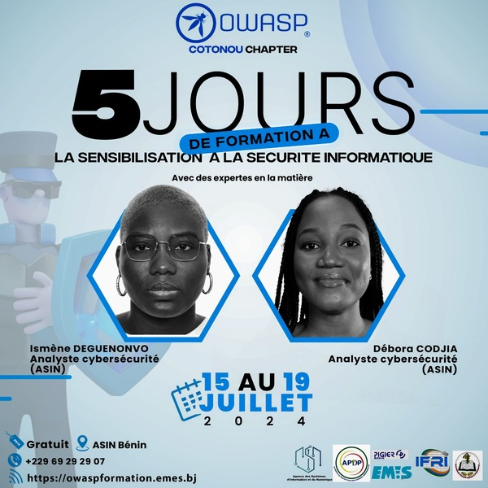
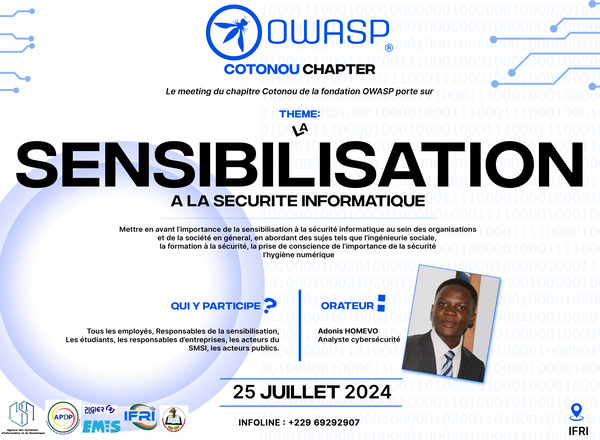

 

### Next Meeting/Event(s)
Our Chapter meetings are held several times a year, which could be at a physical location or online.

For more details on our future events please visit our meetup group:

[https://www.meetup.com/owasp-cotonou-chapter/](https://www.meetup.com/owasp-cotonou-chapter/)

---

---
 
The Chapter of the OWASP foundation, in partnership with the Information Systems and Digital Agency (ASIN), is organizing a 5-day training course from July 15 to 19, 2024 on the theme: awareness of information security. This training is intended for anyone who wishes to deepen their knowledge of IT security so as not to remain the weak link in their organization's security management system. Do not hesitate to register very quickly using the link on the poster (https://owaspformation.emes.bj/) because the number of places is very very limited.

<h4>-------------------------------------------------------------------------------------------------------------------------------------------------------------</h4>

 
The OWASP-Cotonou chapter will hold its firth meeting on ***<i>"IT security awareness"</i>*** which will take place on July, 25 2024 in Cotonou, in the grounds of IFRI.

The meeting will highlight the importance of IT security awareness within organizations and society at large, addressing topics such as social engineering, security training, awareness of the importance of security, digital hygiene.

<h5>Speaker</h5>

<ul>
<li>
    Adonis HOMEVO, Cybersecurity Analyst
</li>
</ul>

OWASP-Cotonou.

