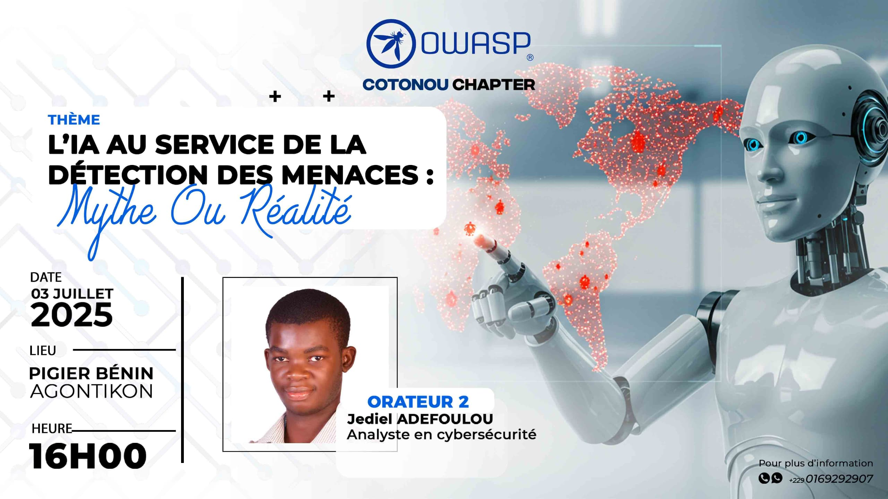

### Next Meeting/Event(s)
Our Chapter meetings are held several times a year, which could be at a physical location or online.

For more details on our future events please visit our meetup group:

[https://www.meetup.com/owasp-cotonou-chapter/](https://www.meetup.com/owasp-cotonou-chapter/)

### Formation sur l'IA et la cybersécurité

Le chapitre OWASP organise le 4 décembre 2025 une formation sur l'IA et la cybersécurité à l' <a href="https://maps.app.goo.gl/kUbrPtBGAg9QPSzq8" >
   APDP à Jericho, Cotonou ?</a> 
La formation de 8h est conçue comme une immersion pratique, avec un mix de théorie, démos et exercices. Elle cible 20-30 participants, en utilisant des outils gratuits comme Google Colab pour l'IA et OWASP ZAP pour les tests. Le syllabus intègre les tendances 2025 : l'IA transformative pour la défense (marché en croissance x10 d'ici 2034) et les menaces comme les AI agents autonomes pour les campagnes d'attaque. L’objectif global est d’équiper les participants pour intégrer l'IA dans leurs pratiques OWASP, avec un certificat de participation.

  

### Intelligence artificielle générative : Un nouvel allié pour les cybercriminels ? 

Le Chapitre OWASP Cotonou organise son prochain meeting le Jeudi 11 décembre 2025 à <a href="https://maps.app.goo.gl/VrzAUxzJMQmtcDTC9" >
   VideoLeader à Gbèdégbé ?</a> , Cotonou, RB à 14h 00.

Le meeting OWASP d’une durée de 2h se focalisera sur des cas concrets pour stimuler les discussions. Il sera structuré en deux sous-thèmes équilibrés, chacun d'environ 45 minutes de présentation/démonstration, suivis de 15 minutes de Q&R. Cela laisse 10 minutes pour l'introduction et la conclusion. Les contenus s'appuient sur les tendances les plus récentes de 2025, comme l'automatisation des phishings via IA (responsable de 16% des incidents cyber rapportés) et l'essor des deepfakes exploitant la confiance humaine. L'objectif est de donner aux participants (développeurs, pentesteurs, RSSI, étudiants, administratifs, directeurs d’entreprise) un aperçu pratique des outils open-source comme ceux basés sur Stable Diffusion pour les attaques, et des défenses comme les modèles Anthropic pour la détection.

  

### AI in the service of threat detection: myth or reality

The OWASP-Cotonou branch will hold its next meeting on the theme "AI in the service of threat detection: myth or reality" on July 3, 2025 in Cotonou, at PIGIER Cotonou.

  

