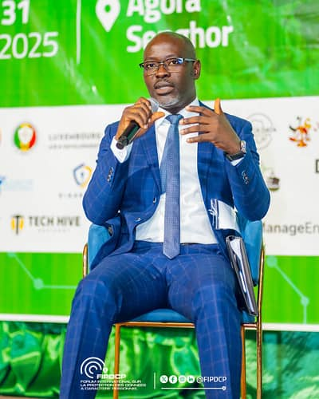
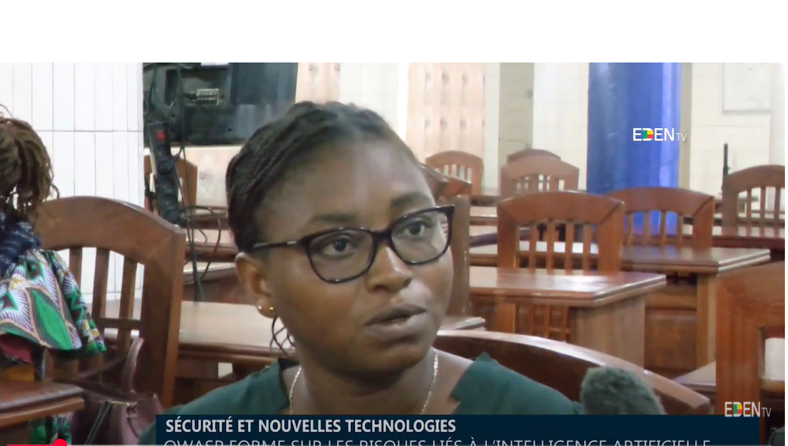
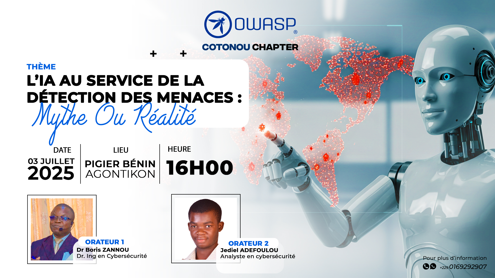
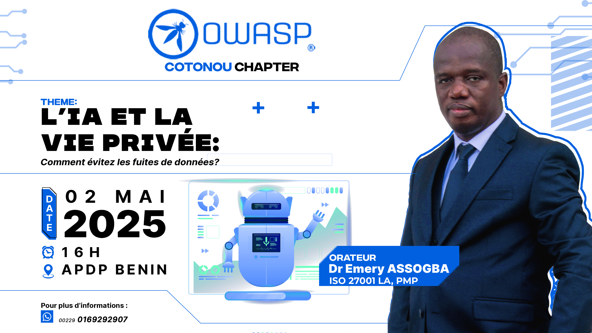
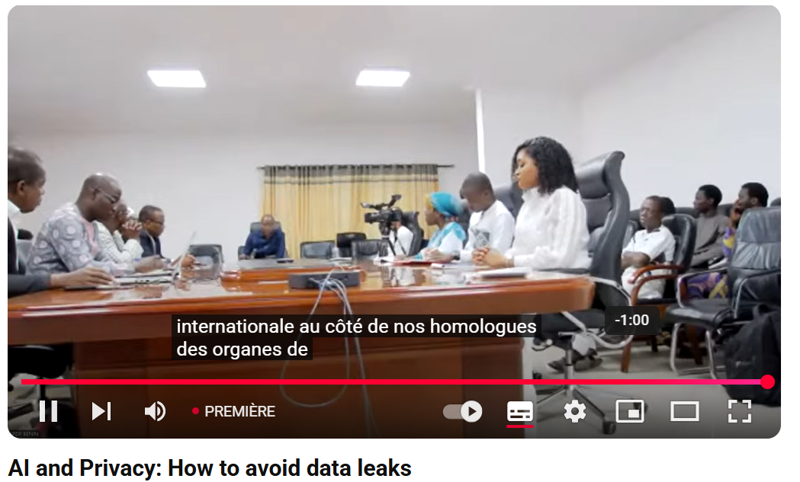
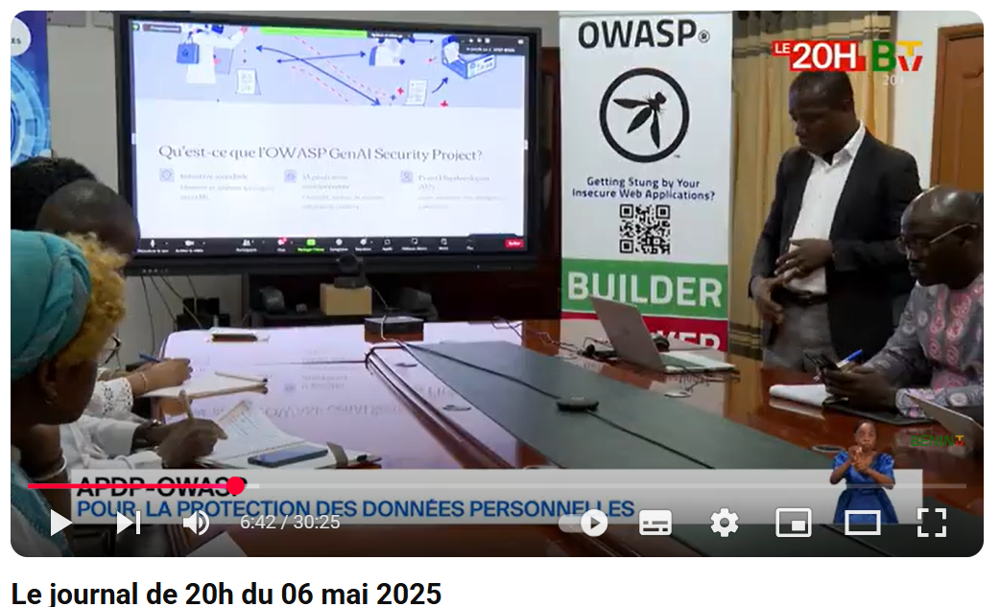
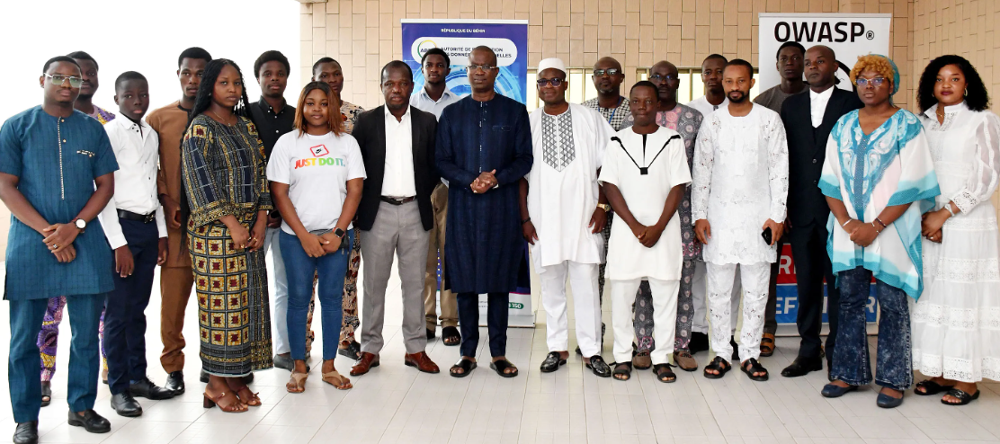
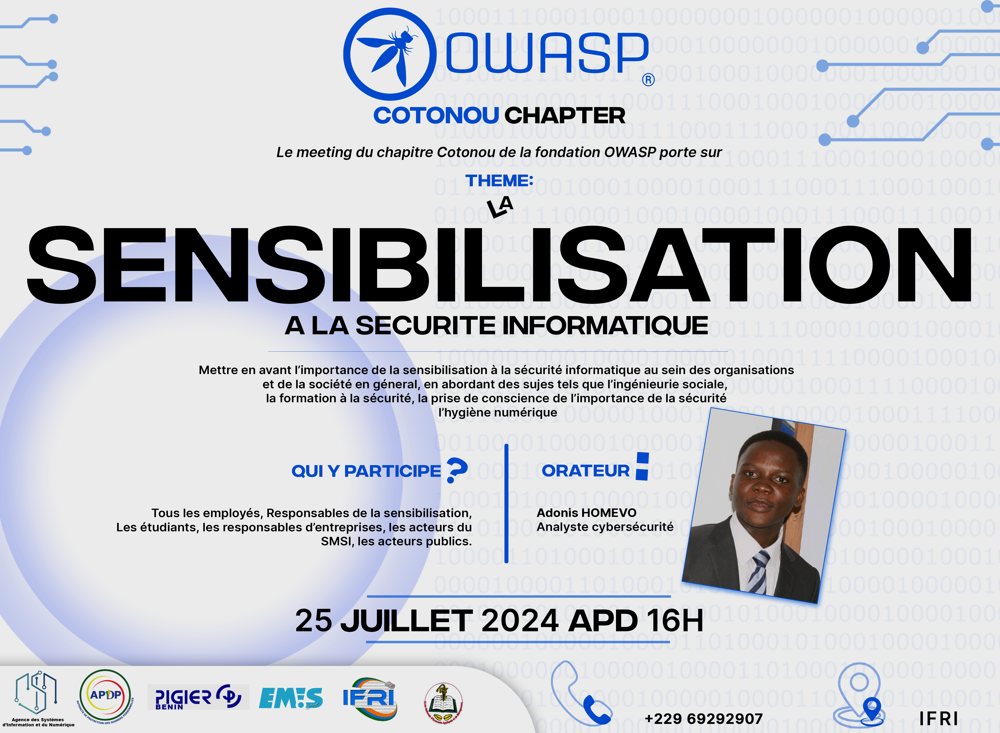
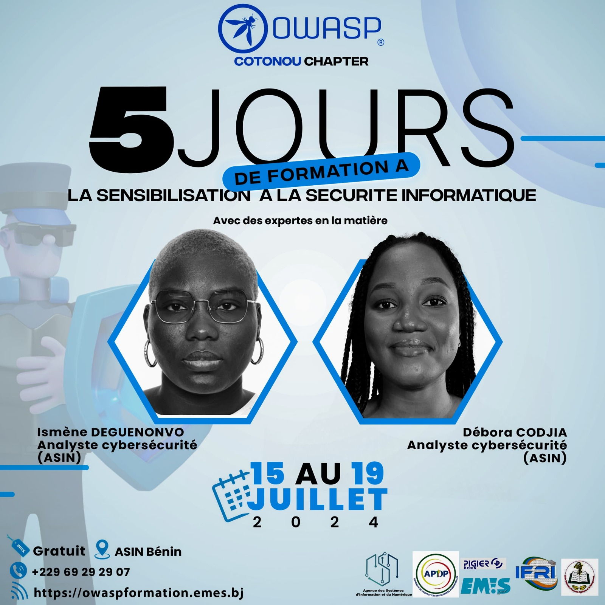

### OWASP COTONOU a participé aux travaux du premier Forum International sur la Protection des Données à Caractère Personnel (FIPDCP) à Lomé.

 

Le Forum International sur la Protection des Données à Caractère Personnel (FIPDCP) tenu les 28-29 et 30 juillet 2025 à Lomé en République Togolaise, a été une rencontre de type international qui a réuni des spécialistes relevant aussi bien du secteur public que du privé et dont l’expertise dans le domaine de la cybersécurité est avérée.  
La salle de conférence Agora Senghor a servi de cadre pour les activités dudit forum placé sous le thème : « Les enjeux de la protection des données au Togo ». Lancés par le Président de l’IPDCP, le Lieutenant-Colonel Bédiani BELEI, qui, dans une allocution solennelle, a salué cette initiative comme un moment décisif dans la construction d’une gouvernance responsable et souveraine des données au Togo et en Afrique.  
Le paneliste Monsieur [Nonfodji Janvier Ahouansou](mailto:janvier.ahouansou@owasp.org) , Ingénieur en Sécurité Informatique et Leader du Chapitre Cotonou de la fondation OWASP a partagé ses 17 années d’expérience dans le monde de la protection des infrastructures supports des services essentiels du secteur de la microfinance au Bénin. Le mercredi 30 juillet 205, durant plus de 60 minutes, Monsieur Nonfodji Janvier AHOUANSOU et ses co-panelistes ont éclairé les participants sur la problématique « Protection des Infrastructures Essentielles et Critiques ». Ce panel modéré par Madame Edwige d’ALMEIDA, Responsable projet IT et solutions digitales, est composé de :  
<ul>
<li>
  [Nonfodji Janvier Ahouansou](mailto:janvier.ahouansou@owasp.org), Ingénieur en Sécurité Informatique, chef Cellule Informatique à l’ANSSFD au Bénin et Leader du Chapitre Cotonou de la Fondation OWASP ;
</li>
<li>
M. Djibril MAHAM, Ancien ingénieur en informatique et calcul haute performance à la NASA, Consultant au Département de la Défense Américaine, CEO CSIS ;
</li>
<li>
M. Franck Tété ADJEGAN, Ingénieur informatique et télécommunications, Directeur technique chez ZTE Corporation 
</li>
<li>
M. Yao Justin KOUMAKO, Doctorant en droit de la cybersécurité, Délégué à la protection des données personnelles (Lion) et membres du comité technique de FIPDCP ;
</li>
</ul>
A la demande de la modératrice, le représentant de la Fondation OWASP-Cotonou justifie la contribution de son association dans la protection des IIE / IIC. Il explique que les infrastructures essentielles et critiques ne fonctionnement pas sans une couche applicative intermédiaire entre le matériel (capteurs, IIoT, automates programmables) et l’humain qui communique les actions à l’équipement. Ainsi, les bonnes pratiques de OWASP et la actions de sensibilisation qu’elle délivre gratuitement, viennent alors renforcées la sécurité de ces applications web / mobiles pour protéger lesdites IIE/IIC.
A la fin des travaux, l’Expert recommande l’une approche globale pour la protection des IIE / IIC allant de la prévention, la résilience et à la coopération publique / privée, nationale / internationale. 

### AI in the service of threat detection: myth or reality

The OWASP-Cotonou branch will held its last meeting on the theme "AI in the service of threat detection: myth or reality" on July 3, 2025 in Cotonou, at PIGIER Cotonou.

<h5>Speaker</h5>

<ul>
<li>
    Jediel ADEFOULOU, Analyste cybersécurité <a href="assets/images/IA-au-service-détection-menaces-mythe-realite.pdf">
    L’IA au service de la détection des menaces: mythe ou réalité?</a>
</li>

</ul>

They talked about the meeting:

   

   

  

 The OWASP-Cotonou chapter would like to thank everyone and especially <a href="https://asin.bj">ASIN BENIN</a>, <a href="https://pigier-benin.com">PIGIER BENIN</a>, <a href="https://emes.bj/">EMES</a>, for their support during the organization of this meeting. Once again, a very big thanks to you.

### AI and Privacy: How to avoid data leaks

The OWASP-Cotonou chapter  held its last meeting on the subject "AI and Privacy: How to Avoid Data Leaks" on May, 2 2025 in Cotonou, in the grounds of APDP (Personal Data Protection Authority).

The meeting will explore the impact of artificial intelligence on privacy protection and identify concrete strategies to prevent data leaks, while raising awareness of the ethical and technical issues related to the use of AI in the management of personal information.

<h5>Speaker</h5>

<ul>
<li>
    Emery K. ASSOGBA, PMP, ISO 27001 LA,PhD <a href="assets/images/ia_viee_privee_comment_eviter_fuite_de_donnes_assogba_emery.pdf">
    L’IA et la vie privée: comment éviterles fuitesde données?</a>
</li>

<li>
    Ing. Célia KASSA <a href="assets/images/Securiser-lIA-Generative-avec-OWASP.pdf">
   Sécuriser l'IA Générative avec OWASP</a>
</li>
</ul>

 
They talked about the meeting:

   

  
  

The OWASP-Cotonou chapter would like to thank everyone and especially <a href="https://asin.bj">ASIN BENIN</a>, <a href="https://apdp.bj">APDP BENIN</a>, <a href="https://emes.bj/">EMES</a>, for their support during the organization of this meeting. Once again, a very big thanks to you.

<h4>---------------------------------------------------------------------------------------------------------------------------------</h4>

The OWASP-Cotonou chapter  hold its firth meeting on "IT security awareness" which   taken place on July, 25 2024 in Cotonou, in the grounds of IFRI.

The meeting highlighted  the importance of IT security awareness within organizations and society at large, addressing topics such as social engineering, security training, awareness of the importance of security, digital hygiene.

 

<h5>Speaker</h5>

<ul>
<li>
    Adonis HOMEVO, Cybersecurity Analyst
</li>
</ul>
The OWASP-Cotonou chapter would like to thank everyone and especially <a href="http://ifri.uac.bj/">IFRI</a>, <a href="https://asin.bj">ASIN BENIN</a>, <a href="https://apdp.bj">APDP BENIN</a>, <a href="https://emes.bj/">EMES</a>, for their support during the organization of this meeting. Once again, a very big thanks to you.

<h4>-------------------------------------------------------------------------------------------------------------------------------------------------------------</h4>

Owasp Cotonou organized in partnership with ASIN Benin, a training workshop for IT professionals on the theme: "awareness of IT security" 24 IT security professionals and stakeholders took part in this training workshop.

<h5>Speakers</h5>

<ul>
<li>
    Ismène DEGUENONVO,  Cybersecurity Analyst at ASIN
</li>
<li>
    Débora CODJIA, Cybersecurity Analyst at ASIN
</li>
 
  
 </ul>
The OWASP-Cotonou chapter would like to thank everyone and especially  <a href="https://asin.bj">ASIN BENIN</a> for their support during the organization of this meeting. Once again, a very big thanks to you.
    
OWASP-Cotonou.

<h4>-------------------------------------------------------------------------------------------------------------------------------------------------------------</h4>

The OWASP-Cotonou chapter held its fourth meeting on ***<i>"The job of the IT auditor: Challenges and Opportunities"</i>*** which took place on October,19 2023 in Cotonou, in the grounds of APDP BENIN and was a great success; thanks to you all.

The main topic of the meeting was the challenges and opportunities of the IT auditor. The speakers addressed topics related to the topic and it was also an opportunity to discover the opportunities offered by the OWASP community to its active members.

<h5>Speakers</h5>

<ul>
<li>
    Dr Emery ASSOGBA, Doctor in engineering science, computer networks option. PhD, Certified Ethical Hacker, exposes 
    <a href="assets/images/owasp-chapter-audit-OWASP-Cotonou.pptx.pdf">
    Auditing norms and standards for the IT function within an organization: Practical values</a>
</li>

<li>
    Dr Evariste SONGBE, accounting expert, exposes 
    <a href="assets/images/Communication-sur-les-lecons-apprises-de-audit.ppt">
    The importance of auditing in the life of an organization: Lessons learned.</a>
</li>

<li>
    <a href="https://cio-mag.com/cybsersecurite-lowasp-forme-a-la-securite-des-applications/">Cybersecurity: OWASP trains in application security.</a>
</li>
</ul>

The OWASP-Cotonou chapter would like to thank everyone and especially <a href="https://apdp.bj">APDP BENIN</a>,
<a href="https://emes.bj/">EMES</a>, <a href="https://asin.bj">ASIN BENIN</a> for their support during the organization of this meeting. Once again, a very big thanks to you.

OWASP-Cotonou.

<h4>-------------------------------------------------------------------------------------------------------------------------------------------------------------</h4>

JINF-CTF was a free computer security problem solving competition organized the last 10/02/2023 by EMES Sarl for computer science students in Benin on the occasion of the computer science day organized by IFRI. It was an opportunity to introduce some web vulnerabilities such as IDOR and XXE

<h5>Speakers</h5>

<ul>
<li>
    Ing Célia Kassa, Network Engineer, exposes 
    <a href="assets/images/owasp-idor.pptx">
    Insecure Direct Object Reference(IDOR)</a>
</li>

<li>
    Ing Orace Kpakpo, Network Engineer, exposes 
    <a href="assets/images/owasp-xml-entity.pptx">
    XML External Entity(XXE)</a>
</li>

</ul>

The OWASP-Cotonou chapter would like to thank everyone and especially <a href="https://ifri-uac.bj/">IFRI</a>,<a href="https://emes.bj/">EMES</a> for their support during the organization of this event. Once again, a very big thanks to you.

OWASP-Cotonou.
<h4>-------------------------------------------------------------------------------------------------------------------------------------------------------------</h4>

The OWASP-Cotonou chapter held its third meeting on ***<i>"Web applications: improving or endangering the lives of users?"</i>*** which took place on April 20, 2023 in Cotonou, in the grounds of PIGIER BENIN and was a great success.

The main topic of the meeting was impact of web applications on end user. The speakers addressed topics related to the topic. It was an opportunity to discover the opportunities offered by the OWASP community to its active members.

<h5>Speakers</h5>

<ul>
<li>
    Orace KPAKPO, Networks and Systems Engineer, Cybersecurity Analyst at EMES SARL, leader of the OWASP Cotonou chapter, exposes 
    <a href="">
    Impacts of digitalization on Internet users</a>
</li>

<li>
    Victor OYETOLA, ICT Expert, head of SPTIC at UAC, exposes 
    <a href="">
    Digitization and security in Benin</a>
</li>

</ul>

The OWASP-Cotonou chapter would like to thank everyone and especially <a href="https://pigier-benin.com/">PIGIER-BENIN</a>,
<a href="https://emes.bj/">EMES</a> for their support during the organization of this meeting. Once again, a very big thanks to you.

OWASP-Cotonou.

<h4>-------------------------------------------------------------------------------------------------------------------------------------------------------------</h4>

JINF-CTF was a free computer security problem solving competition organized the last 10/02/2023 by EMES Sarl for computer science students in Benin on the occasion of the computer science day organized by IFRI. It was an opportunity to introduce some web vulnerabilities such as IDOR and XXE

<h5>Speakers</h5>

<ul>
<li>
    Ing Célia Kassa, Network Engineer, exposes 
    <a href="assets/images/owasp-idor.pptx">
    Insecure Direct Object Reference(IDOR)</a>
</li>

<li>
    Ing Orace Kpakpo, Network Engineer, exposes 
    <a href="assets/images/owasp-xml-entity.pptx">
    XML External Entity(XXE)</a>
</li>

</ul>

The OWASP-Cotonou chapter would like to thank everyone and especially <a href="https://ifri-uac.bj/">IFRI</a>,<a href="https://emes.bj/">EMES</a> for their support during the organization of this event. Once again, a very big thanks to you.

OWASP-Cotonou.
<h4>-------------------------------------------------------------------------------------------------------------------------------------------------------------</h4>

The OWASP-Cotonou chapter held its second meeting on ***<i>"Personal data protection:challenges and opportunities"</i>*** which took place on December 01, 2022 in Cotonou, Gbégamey in the grounds of APDP and was a great success.

The main topic of the meeting was challenges and opportunities of personal data protection. The speakers addressed topics related to the challenges of data protection within the company and the constraints imposed by the regulator. It was an opportunity to discover the opportunities offered by the OWASP community to its active members.

<h5>Speakers</h5>

<ul>
<li>
    Dr Arnaud Ahouandjinou Head of the IS Department of IFRI/UAC, exposes 
    <a href="assets/images/Present-OWASP-AhA.pptx">
    Protection of personal data within African companies: opportunities and challenges</a>
</li>

<li>
    Dr Lionel Metongnon expert in IoT security, exposes 
    <a href="assets/images/owasp-chapter-OWASP-La-tokenisation-comme-mesure-de-protection-des-données-personnelles.pptx">
    Tokenization as a personal data protection measure</a>
</li>

<li>
    Dr Emery ASSOGBA, Doctor in engineering science, computer networks option. PhD, Certified Ethical Hacker, introduce
    <a href="owasp-chapter-OWASP-Web-Security-Testing-Guide.pptx.pdf">
    OWASP Foundation and OWASP-Cotonou</a>
</li>
</ul>

Here is the recorded <a href="https://www.youtube.com/watch?v=DZ0-ybyA8JM">meeting</a>

The OWASP-Cotonou chapter would like to thank everyone and especially <a href="https://www.apdp.bj/">APDP</a>,<a href="https://emes.bj/">EMES</a> for their support during the organization of this meeting. Once again, a very big thanks to you.

OWASP-Cotonou.

<h4>-------------------------------------------------------------------------------------------------------------------------------------------------------------</h4>

The OWASP-Cotonou chapter held its first meeting on ***<i>"Tools and best practices for securing information systems in Benin"</i>*** which took place on July 07, 2022 in Cotonou, Gbégamey in the grounds of ENEAM and was a great success.

<h5>Speakers</h5>

<ul>
<li>
    Mr Orace KPAKPO , Expert in computer networks, Expert in eBPF technology and leader of the OWASP-Cotonou chapter introduce
    <a href="https://fr.scribd.com/presentation/583222986/Presentation-d-OWASP">OWASP Foundation</a>,  
    <a href="https://www.youtube.com/watch?v=I0RkUlpzF6w&t=7s">here is the presentation in video</a>
</li>

<li>
    Mrs KASSA Célia, Expert in computer network performance analysis introduce
    <a href="https://fr.scribd.com/presentation/583223907/Presentation-du-chapitre-OWASP-Cotonou">OWASP-Cotonou chapter</a>, 
    <a href="https://www.youtube.com/watch?v=I0RkUlpzF6w&t=7s">here is the presentation in video</a>
</li>

<li>
    Mr Caleb K. Sambienou, Engineer in Information Systems and Computer Networks, JAVA Backend Developer (Spring Boot),
    Front-end Developer (Angular), Consultant, exposes <a href="https://fr.scribd.com/presentation/583225461/Donnees-a-caractere-personnel-Enjeu-securitaire-pour-les-entreprises-et-les-individus">Personal data: Security issue for companies and individuals</a>, 
    <a href="https://www.youtube.com/watch?v=MVRGdjG39TI&t=596s">here is the presentation in video</a>
</li>

<li>
    Mr Emery ASSOGBA, Doctor in engineering science, computer networks option. PhD, Certified Ethical Hacker, exposes 
<a href="https://fr.scribd.com/presentation/583226393/Ameliorer-la-securite-des-E-services-avec-OWASP-Web-Security-Testing-Guide">
Security improvement of E-services with owasp web security testing Guide</a>, 
    <a href="https://www.youtube.com/watch?v=3Tv3pGO3K2g&t=7s">here is the presentation in video</a>
</li>
</ul>

The OWASP-Cotonou chapter would like to thank everyone and especially its donors (<a href="https://emes.bj/">EMES</a>, <a href="http://eneam.uac.bj/">ENEAM</a>) and his guests <a href="https://www.apdp.bj/">APDP</a> & <a href="https://anssi.bj/">ANSSI</a> for their support during the organization of its first meeting. Once again, a very big thanks to you.

OWASP-Cotonou.

