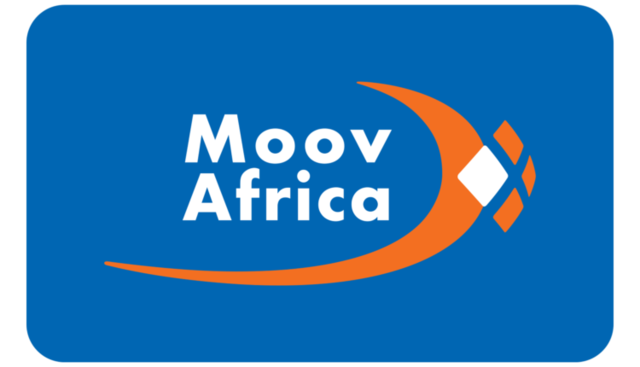

#### *Supporters and Sponsors of OWASP Cotonou*

> * ## EMES SARL

> * ## MTN 
<figure>
    
    <figcaption align="left">
        
<h5><i>Founded in 1994, the MTN Group is a pan-African mobile and telecommunications operator. MTN is headquartered in Johannesburg, South Africa, and listed on the JSE Securities Exchange under share code MTN. MTN has 232 million mobile subscribers and 20 million mobile money subscribers throughout operations in Afghanistan, Benin, Botswana, Cameroon, Côte d’Ivoire, Cyprus, Ghana, Guinea Bissau, the Republic of Guinea, Iran, Liberia, Nigeria, the Republic of Congo (Congo-Brazzaville), Rwanda, South Africa, Sudan, South Sudan, Swaziland, Syria, Uganda, Yemen and Zambia. MTN’s vision is to lead the delivery of a bold new digital world by building a best-in-class experience for customers.</i></h5>

    </figcaption>
</figure>

> * ## MOOV
<figure>
    
    <figcaption align="left">
        
Mnt----

    </figcaption>
</figure>

> * ## UAC 
<figure>
    
    <figcaption align="left">
        
Mnt----

    </figcaption>
</figure>

> * ## IFRI 
<figure>
    
    <figcaption align="left">
        
Mnt----

    </figcaption>
</figure>

> * ## Banks

> * ## ANSSI 
<figure>
    
    <figcaption align="left">
        
Mnt----

    </figcaption>
</figure>
